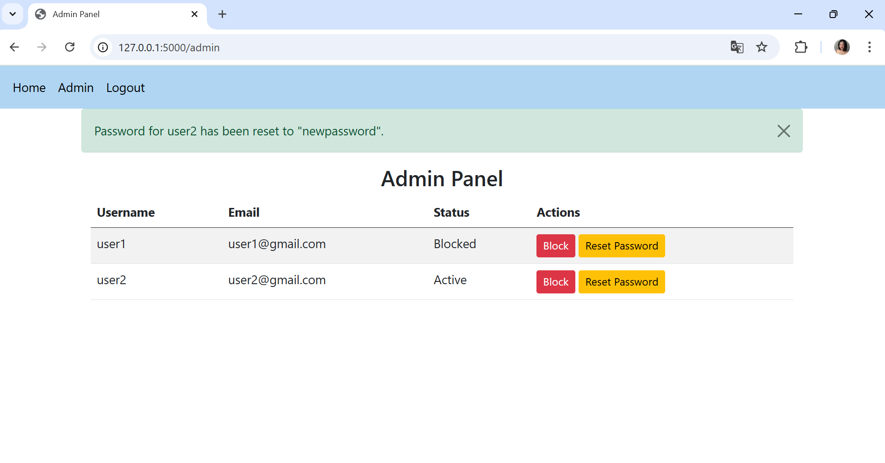

# Rekease Version 3
**Thay đổi**: Thêm trang admin để quản lý người dùng. Admin có thể khóa (block) người dùng hoặc reset mật khẩu. Người dùng bị khóa sẽ không thể đăng nhập và thấy thông báo "Tài khoản của bạn đã bị khóa".
**Screenshot**
- ví dụ dăng kí với vai trò là admin : 
- Khi đăng kí xong sẽ chuyển sang trang đăng nhập: 
- khi đăng nhập xong sẽ chuyển sang trang blog và có admin ở thanh điều hướng: 
- Sau khi nhấn vào admin ở trên thanh điều hướng sẽ chuyển sang trang Admin Panel để thực hiện các thao tác block và reset mật khẩu: 
- khi nhấn block thì hệ thống sẽ thông báo:  là đã block user đó, và sau khi đăng nhập lại với user trên hệ thống thông báo tài khoản đã bị khóa:  và trang Admin Panel cũng sẽ cập nhật trạng tgasi của user 

- Khi chọn reset password hệ thống sẽ hiểu thị: 
- sau đó khi đăng nhập lại user với mật khẩu cũ, hệ thống sẽ thông báo: 
- khi đăng nhập lại với mật khẩu mới "newpassord" thì user có thể login vào được: 