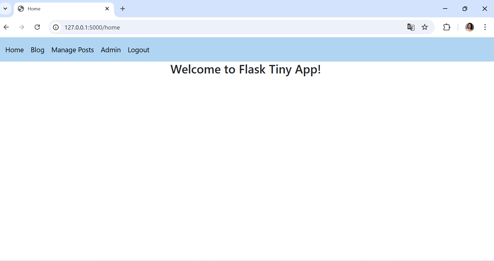
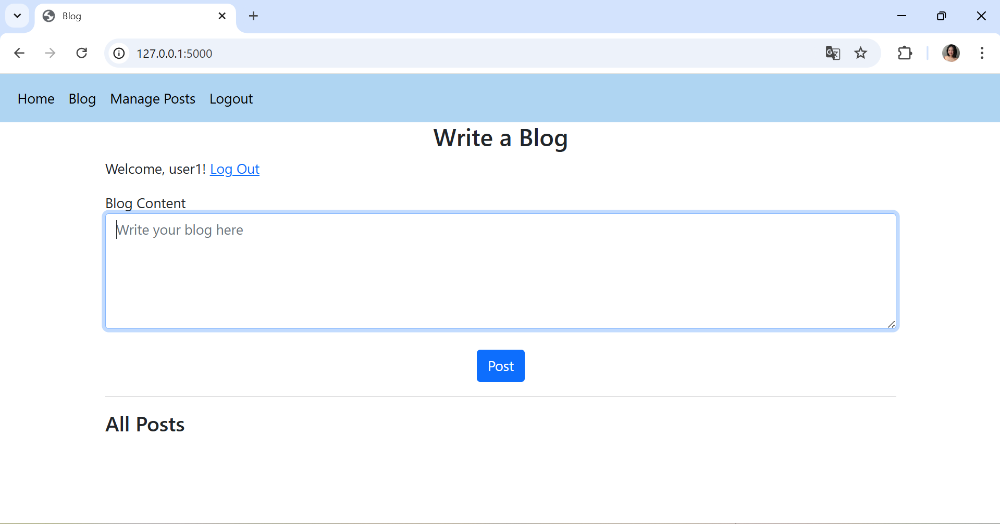
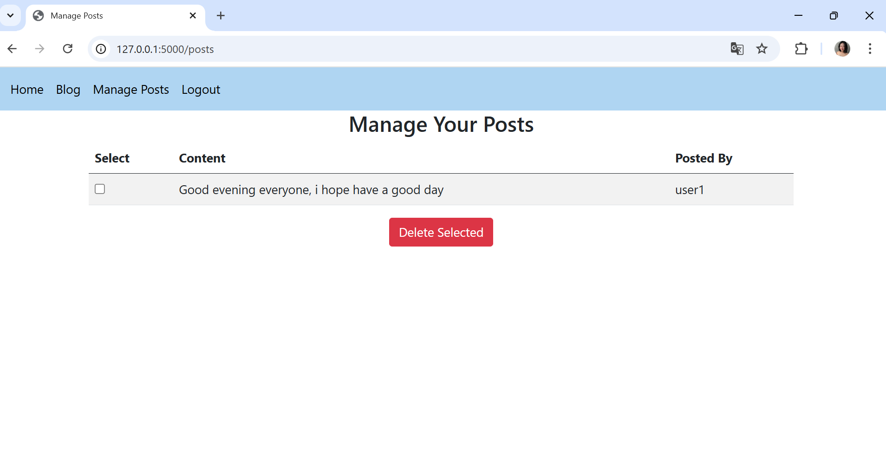
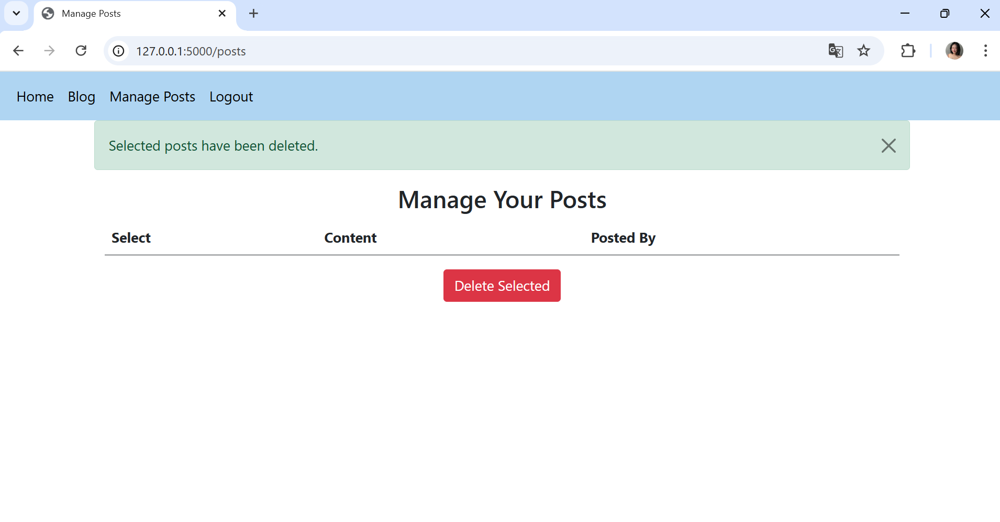

# Release version 4
**Thay đổi**:
  - Thêm trang quản lý bài viết (/posts) cho phép người dùng xem danh sách bài viết của mình.
  - Hỗ trợ xóa nhiều bài viết cùng lúc thông qua checkbox.
  - Lưu bài viết vào file posts.json để giữ trạng thái giữa các lần khởi động lại.
**Screenshots**
- Với version 4 thì sẽ có các chức năng mới như sau: 

- 
- Khi tạo một bài post thì bài post đó sẽ được thêm vào danh sách và hiển thị trong manage post:  và người dùng có thể xóa bài post mà mình đã tạo 