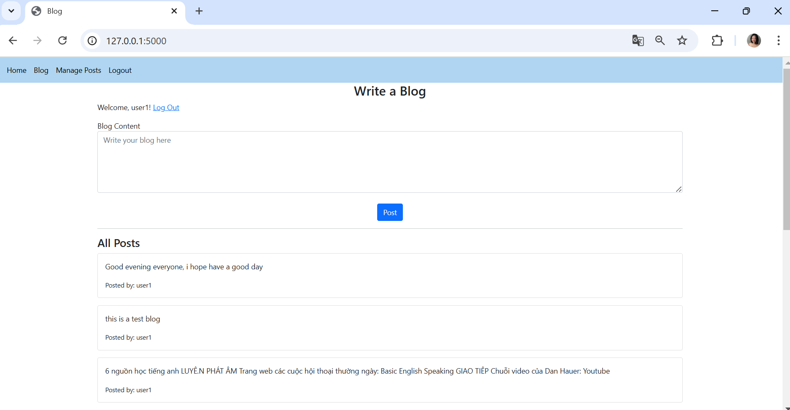
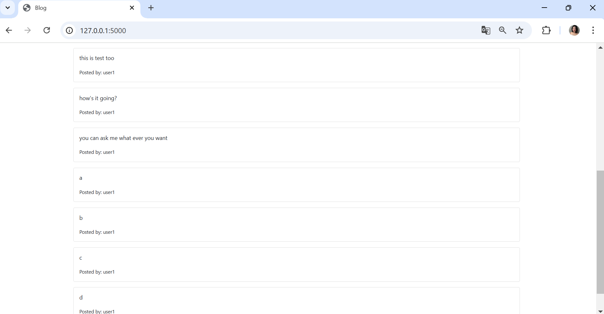
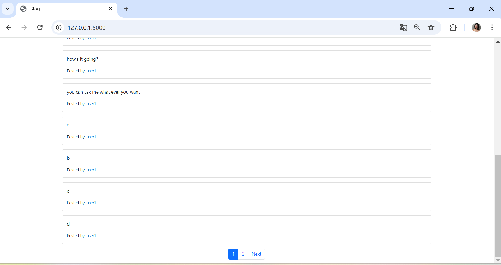
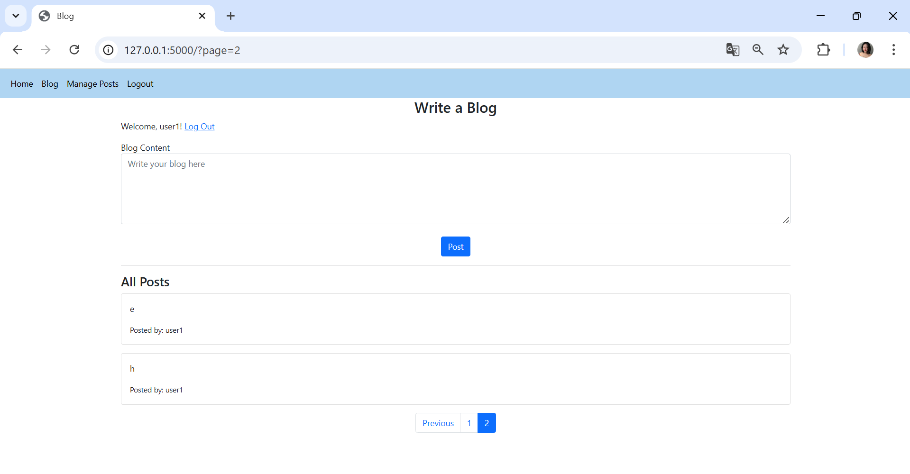
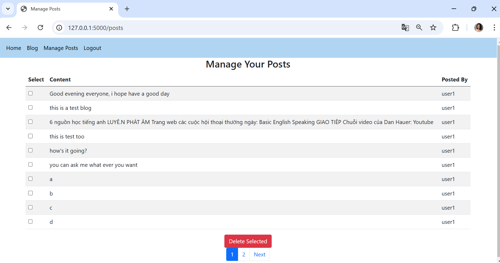

# Release Version 5
- **Thay đổi**:
  - Thêm phân trang cho trang quản lý bài viết (/posts), hiển thị 10 bài viết mỗi trang.
  - Thêm 50 bài viết giả lập cho user1 và user2 để kiểm tra phân trang.
- **Screenshot**: 
- đây là trang viết blog và hiển thị 10 bài post và có phân trang:   
- khi nhấn next hoặc số 2 thì sẽ chuyển sang trang tiếp: 
- và trong chức năng manage posts cũng có chức năng phân trang: 